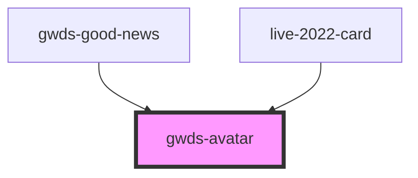

# gwds-avatar

<!-- Auto Generated Below -->

## Properties

| Property | Attribute | Description | Type                          | Default                                                  |
| -------- | --------- | ----------- | ----------------------------- | -------------------------------------------------------- |
| `imgAlt` | `img-alt` |             | `string`                      | `null`                                                   |
| `imgUrl` | `img-url` |             | `string`                      | `getAssetPath(`./assets/images/avatar-placeholder.svg`)` |
| `line`   | `line`    |             | `boolean`                     | `false`                                                  |
| `size`   | `size`    |             | `"l" \| "m" \| "xl" \| "xxl"` | `'m'`                                                    |

## Dependencies

### Used by

 - [gwds-good-news](../gwds-good-news)
 - [live-2022-card](../live-2022-card)

### Graph

----------------------------------------------

*Built with [StencilJS](https://stenciljs.com/)*
