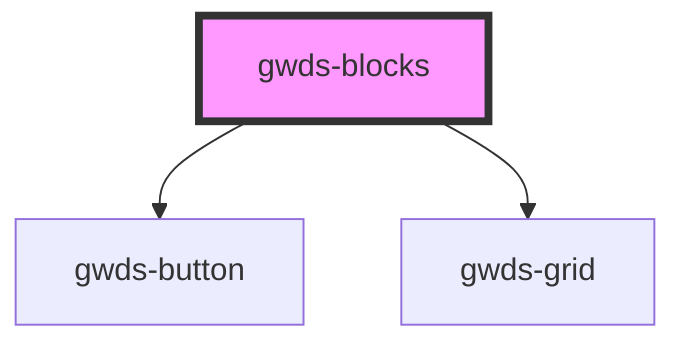

# gwds-blocks

<!-- Auto Generated Below -->

## Properties

| Property      | Attribute      | Description | Type                                   | Default      |
| ------------- | -------------- | ----------- | -------------------------------------- | ------------ |
| `bgColor`     | `bg-color`     |             | `string`                               | `'dark-100'` |
| `buttonLabel` | `button-label` |             | `string`                               | `null`       |
| `buttonUrl`   | `button-url`   |             | `string`                               | `null`       |
| `description` | `description`  |             | `string`                               | `null`       |
| `display`     | `display`      |             | `"grid-2" \| "grid-3" \| "grid-aside"` | `'grid-2'`   |
| `linkLabel`   | `link-label`   |             | `string`                               | `null`       |
| `linkTarget`  | `link-target`  |             | `"_blank" \| "_self"`                  | `'_self'`    |
| `linkUrl`     | `link-url`     |             | `string`                               | `null`       |
| `mainTitle`   | `main-title`   |             | `string`                               | `null`       |

## Dependencies

### Depends on

- [gwds-button](../gwds-button)
- [gwds-grid](../gwds-grid)

### Graph

----------------------------------------------

*Built with [StencilJS](https://stenciljs.com/)*
