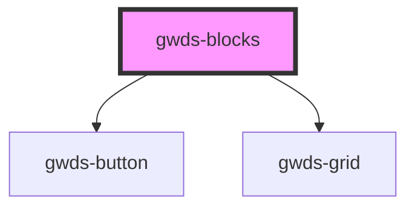

# gwds-blocks

<!-- Auto Generated Below -->

## Properties

| Property             | Attribute              | Description | Type                                     | Default      |
| -------------------- | ---------------------- | ----------- | ---------------------------------------- | ------------ |
| `bgColor`            | `bg-color`             |             | `string`                                 | `'dark-100'` |
| `description`        | `description`          |             | `string`                                 | `null`       |
| `display`            | `display`              |             | `"grid-2" \| "grid-3" \| "grid-aside"`   | `'grid-2'`   |
| `firstButtonLabel`   | `first-button-label`   |             | `string`                                 | `null`       |
| `firstButtonTarget`  | `first-button-target`  |             | `"_blank" \| "_self"`                    | `'_self'`    |
| `firstButtonType`    | `first-button-type`    |             | `"primary" \| "secondary" \| "tertiary"` | `'primary'`  |
| `firstButtonUrl`     | `first-button-url`     |             | `string`                                 | `null`       |
| `linkLabel`          | `link-label`           |             | `string`                                 | `null`       |
| `linkTarget`         | `link-target`          |             | `"_blank" \| "_self"`                    | `'_self'`    |
| `linkUrl`            | `link-url`             |             | `string`                                 | `null`       |
| `mainTitle`          | `main-title`           |             | `string`                                 | `null`       |
| `secondButtonLabel`  | `second-button-label`  |             | `string`                                 | `null`       |
| `secondButtonTarget` | `second-button-target` |             | `"_blank" \| "_self"`                    | `'_self'`    |
| `secondButtonType`   | `second-button-type`   |             | `"primary" \| "secondary" \| "tertiary"` | `'primary'`  |
| `secondButtonUrl`    | `second-button-url`    |             | `string`                                 | `null`       |
| `thirdButtonLabel`   | `third-button-label`   |             | `string`                                 | `null`       |
| `thirdButtonTarget`  | `third-button-target`  |             | `"_blank" \| "_self"`                    | `'_self'`    |
| `thirdButtonType`    | `third-button-type`    |             | `"primary" \| "secondary" \| "tertiary"` | `'primary'`  |
| `thirdButtonUrl`     | `third-button-url`     |             | `string`                                 | `null`       |

## Dependencies

### Depends on

- [gwds-button](../gwds-button)
- [gwds-grid](../gwds-grid)

### Graph

----------------------------------------------

*Built with [StencilJS](https://stenciljs.com/)*
