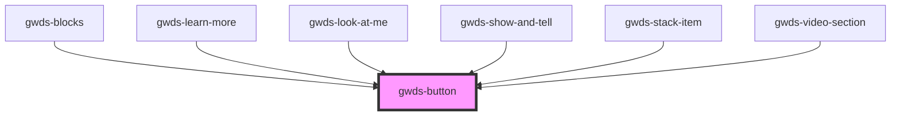

# gw-button

<!-- Auto Generated Below -->

## Properties

| Property | Attribute | Description | Type                                     | Default     |
| -------- | --------- | ----------- | ---------------------------------------- | ----------- |
| `label`  | `label`   |             | `string`                                 | `null`      |
| `m0`     | `m-0`     |             | `boolean`                                | `false`     |
| `size`   | `size`    |             | `"regular" \| "small"`                   | `'regular'` |
| `target` | `target`  |             | `"_blank" \| "_self"`                    | `'_self'`   |
| `type`   | `type`    |             | `"primary" \| "secondary" \| "tertiary"` | `'primary'` |
| `url`    | `url`     |             | `string`                                 | `null`      |

## Dependencies

### Used by

 - [gwds-blocks](../gwds-blocks)
 - [gwds-learn-more](../gwds-learn-more)
 - [gwds-look-at-me](../gwds-look-at-me)
 - [gwds-show-and-tell](../gwds-show-and-tell)
 - [gwds-stack-item](../gwds-stack-item)
 - [gwds-video-section](../gwds-video-section)

### Graph

----------------------------------------------

*Built with [StencilJS](https://stenciljs.com/)*
