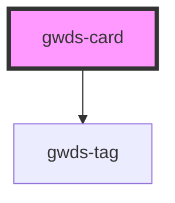

# gwds-card

<!-- Auto Generated Below -->

## Properties

| Property     | Attribute     | Description | Type      | Default   |
| ------------ | ------------- | ----------- | --------- | --------- |
| `bgColor`    | `bg-color`    |             | `string`  | `'white'` |
| `imgAlt`     | `img-alt`     |             | `string`  | `null`    |
| `imgSrc`     | `img-src`     |             | `string`  | `null`    |
| `linkLabel`  | `link-label`  |             | `string`  | `null`    |
| `linkTarget` | `link-target` |             | `string`  | `'_self'` |
| `linkUrl`    | `link-url`    |             | `string`  | `null`    |
| `noShadow`   | `no-shadow`   |             | `boolean` | `false`   |
| `tagLabel`   | `tag-label`   |             | `string`  | `null`    |
| `titleLabel` | `title-label` |             | `string`  | `null`    |

## Dependencies

### Depends on

- [gwds-tag](../gwds-tag)

### Graph

----------------------------------------------

*Built with [StencilJS](https://stenciljs.com/)*
