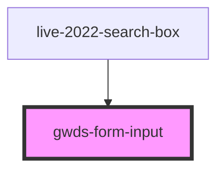

# gwds-form-input

<!-- Auto Generated Below -->

## Properties

| Property      | Attribute     | Description | Type     | Default   |
| ------------- | ------------- | ----------- | -------- | --------- |
| `maxWidth`    | `max-width`   |             | `string` | `'100%'`  |
| `minWidth`    | `min-width`   |             | `string` | `'250px'` |
| `placeholder` | `placeholder` |             | `string` | `null`    |

## Dependencies

### Used by

 - [live-2022-search-box](../live-2022-search-box)

### Graph

----------------------------------------------

*Built with [StencilJS](https://stenciljs.com/)*
