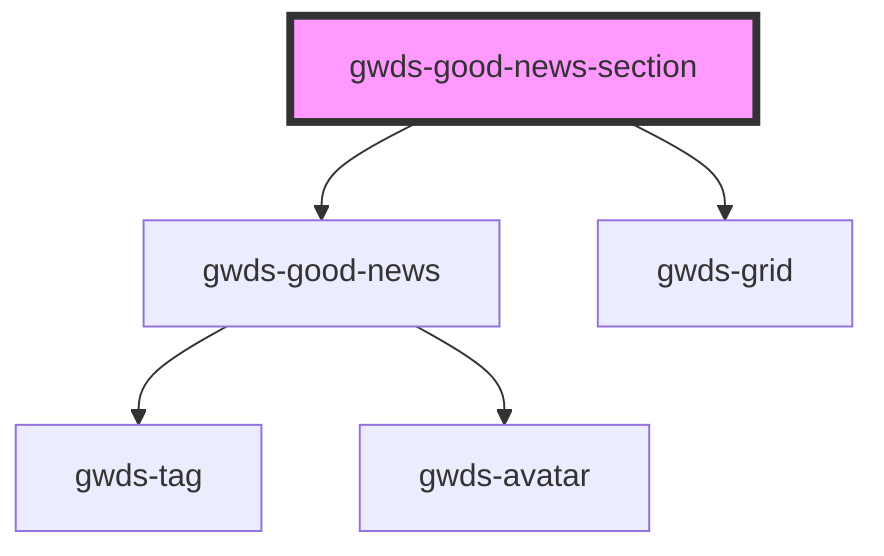

# gwds-good-news-section

<!-- Auto Generated Below -->

## Properties

| Property       | Attribute       | Description | Type           | Default     |
| -------------- | --------------- | ----------- | -------------- | ----------- |
| `data`         | --              |             | `Object[]`     | `undefined` |
| `layout`       | `layout`        |             | `"l1" \| "l2"` | `'l1'`      |
| `sectionTitle` | `section-title` |             | `string`       | `null`      |
| `test`         | `test`          |             | `string`       | `null`      |

## Dependencies

### Depends on

- [gwds-good-news](../gwds-good-news)
- [gwds-grid](../gwds-grid)

### Graph

----------------------------------------------

*Built with [StencilJS](https://stenciljs.com/)*
