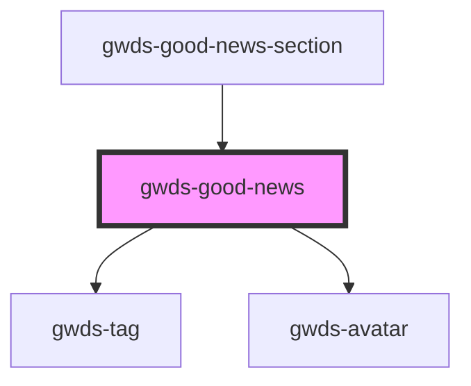

# gwds-good-news

<!-- Auto Generated Below -->

## Properties

| Property          | Attribute           | Description | Type           | Default |
| ----------------- | ------------------- | ----------- | -------------- | ------- |
| `authorAvatarAlt` | `author-avatar-alt` |             | `string`       | `null`  |
| `authorAvatarUrl` | `author-avatar-url` |             | `string`       | `null`  |
| `authorName`      | `author-name`       |             | `string`       | `null`  |
| `category`        | `category`          |             | `string`       | `null`  |
| `date`            | `date`              |             | `string`       | `null`  |
| `imgAlt`          | `img-alt`           |             | `string`       | `null`  |
| `imgUrl`          | `img-url`           |             | `string`       | `null`  |
| `layout`          | `layout`            |             | `"l1" \| "l2"` | `'l1'`  |
| `newsTitle`       | `news-title`        |             | `string`       | `null`  |
| `url`             | `url`               |             | `string`       | `null`  |

## Dependencies

### Used by

 - [gwds-good-news-section](../gwds-good-news-section)

### Depends on

- [gwds-tag](../gwds-tag)
- [gwds-avatar](../gwds-avatar)

### Graph

----------------------------------------------

*Built with [StencilJS](https://stenciljs.com/)*
