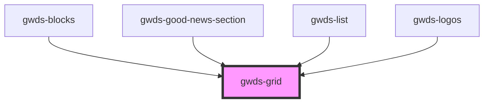

# gwds-grid

<!-- Auto Generated Below -->

## Properties

| Property | Attribute | Description | Type                       | Default |
| -------- | --------- | ----------- | -------------------------- | ------- |
| `perRow` | `per-row` |             | `"2" \| "3" \| "4" \| "6"` | `'3'`   |

## Dependencies

### Used by

 - [gwds-blocks](../gwds-blocks)
 - [gwds-good-news-section](../gwds-good-news-section)
 - [gwds-list](../gwds-list)
 - [gwds-logos](../gwds-logos)

### Graph

----------------------------------------------

*Built with [StencilJS](https://stenciljs.com/)*
