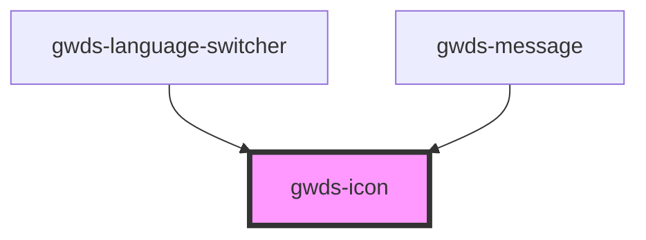

# gwds-icon

<!-- Auto Generated Below -->

## Properties

| Property | Attribute | Description                                                                   | Type                 | Default |
| -------- | --------- | ----------------------------------------------------------------------------- | -------------------- | ------- |
| `color`  | `color`   | The color of the icon.                                                        | `string`             | `null`  |
| `lazy`   | `lazy`    | If enabled, the icon will be loaded lazily when it's visible in the viewport. | `boolean`            | `false` |
| `size`   | `size`    | The size of the icon. Possible values: small, medium, large.                  | `"m" \| "s" \| "xs"` | `'s'`   |
| `src`    | `src`     | The URL of the icon.                                                          | `string`             | `''`    |

## Dependencies

### Used by

 - [gwds-language-switcher](../gwds-language-switcher)
 - [gwds-message](../gwds-message)

### Graph

----------------------------------------------

*Built with [StencilJS](https://stenciljs.com/)*
