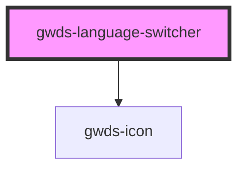

# gwds-language-switcher

<!-- Auto Generated Below -->

## Properties

| Property       | Attribute       | Description | Type                   | Default |
| -------------- | --------------- | ----------- | ---------------------- | ------- |
| `enUrl`        | `en-url`        |             | `string`               | `null`  |
| `esUrl`        | `es-url`        |             | `string`               | `null`  |
| `ptUrl`        | `pt-url`        |             | `string`               | `null`  |
| `selectedLang` | `selected-lang` |             | `"en" \| "es" \| "pt"` | `null`  |

## Dependencies

### Depends on

- [gwds-icon](../gwds-icon)

### Graph

----------------------------------------------

*Built with [StencilJS](https://stenciljs.com/)*
