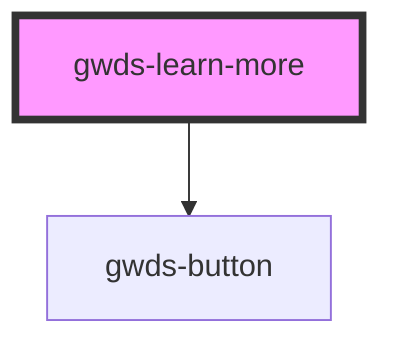

# gwds-learn-more

<!-- Auto Generated Below -->

## Properties

| Property    | Attribute    | Description | Type      | Default      |
| ----------- | ------------ | ----------- | --------- | ------------ |
| `bgColor`   | `bg-color`   |             | `string`  | `'dark-100'` |
| `bpBlank`   | `bp-blank`   |             | `boolean` | `false`      |
| `bpLabel`   | `bp-label`   |             | `string`  | `null`       |
| `bpUrl`     | `bp-url`     |             | `string`  | `null`       |
| `bsBlank`   | `bs-blank`   |             | `boolean` | `false`      |
| `bsLabel`   | `bs-label`   |             | `string`  | `null`       |
| `bsUrl`     | `bs-url`     |             | `string`  | `null`       |
| `mainTitle` | `main-title` |             | `string`  | `null`       |
| `pb0`       | `pb-0`       |             | `boolean` | `false`      |
| `pt0`       | `pt-0`       |             | `boolean` | `false`      |
| `whiteText` | `white-text` |             | `boolean` | `false`      |

## Dependencies

### Depends on

- [gwds-button](../gwds-button)

### Graph

----------------------------------------------

*Built with [StencilJS](https://stenciljs.com/)*
