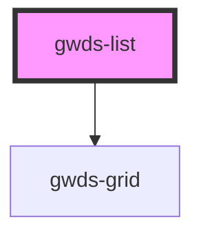

# gwds-list

<!-- Auto Generated Below -->

## Properties

| Property      | Attribute     | Description | Type      | Default |
| ------------- | ------------- | ----------- | --------- | ------- |
| `bgColor`     | `bg-color`    |             | `string`  | `null`  |
| `description` | `description` |             | `string`  | `null`  |
| `mainTitle`   | `main-title`  |             | `string`  | `null`  |
| `pb0`         | `pb-0`        |             | `boolean` | `false` |
| `pt0`         | `pt-0`        |             | `boolean` | `false` |

## Dependencies

### Depends on

- [gwds-grid](../gwds-grid)

### Graph

----------------------------------------------

*Built with [StencilJS](https://stenciljs.com/)*
