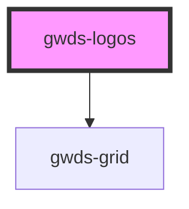

# gwds-logos

<!-- Auto Generated Below -->

## Properties

| Property    | Attribute    | Description | Type     | Default |
| ----------- | ------------ | ----------- | -------- | ------- |
| `mainTitle` | `main-title` |             | `string` | `null`  |

## Dependencies

### Depends on

- [gwds-grid](../gwds-grid)

### Graph

----------------------------------------------

*Built with [StencilJS](https://stenciljs.com/)*
