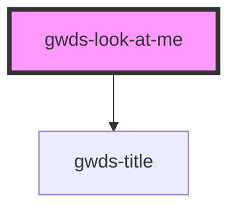

# gw-look-at-me

<!-- Auto Generated Below -->

## Properties

| Property       | Attribute        | Description | Type                            | Default    |
| -------------- | ---------------- | ----------- | ------------------------------- | ---------- |
| `alignContent` | `align-content`  |             | `"center" \| "left" \| "right"` | `'left'`   |
| `bgColor`      | `bg-color`       |             | `string`                        | `null`     |
| `bgImage`      | `bg-image`       |             | `string`                        | `null`     |
| `bgImageFour`  | `bg-image-four`  |             | `string`                        | `null`     |
| `bgImageOne`   | `bg-image-one`   |             | `string`                        | `null`     |
| `bgImageThree` | `bg-image-three` |             | `string`                        | `null`     |
| `bgImageTwo`   | `bg-image-two`   |             | `string`                        | `null`     |
| `bgSize`       | `bg-size`        |             | `string`                        | `'1600px'` |
| `mainTitle`    | `main-title`     |             | `string`                        | `null`     |
| `pB0`          | `p-b-0`          |             | `boolean`                       | `false`    |
| `pT0`          | `p-t-0`          |             | `boolean`                       | `false`    |
| `preTitle`     | `pre-title`      |             | `string`                        | `null`     |
| `test`         | `test`           |             | `string`                        | `null`     |
| `whiteText`    | `white-text`     |             | `boolean`                       | `false`    |

## Dependencies

### Depends on

- [gwds-title](../gwds-title)

### Graph

----------------------------------------------

*Built with [StencilJS](https://stenciljs.com/)*
