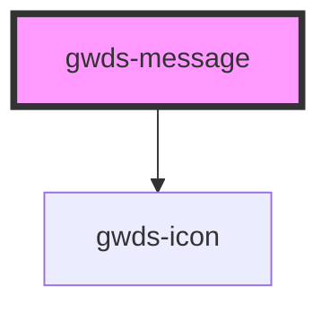

# gwds-message

<!-- Auto Generated Below -->

## Properties

| Property       | Attribute       | Description | Type                  | Default    |
| -------------- | --------------- | ----------- | --------------------- | ---------- |
| `bgColor`      | `bg-color`      |             | `string`              | `'red-50'` |
| `buttonLabel`  | `button-label`  |             | `string`              | `null`     |
| `buttonTarget` | `button-target` |             | `"_blank" \| "_self"` | `'_self'`  |
| `buttonUrl`    | `button-url`    |             | `string`              | `null`     |
| `fixed`        | `fixed`         |             | `boolean`             | `false`    |
| `linkLabel`    | `link-label`    |             | `string`              | `null`     |
| `linkTarget`   | `link-target`   |             | `"_blank" \| "_self"` | `'_self'`  |
| `linkUrl`      | `link-url`      |             | `string`              | `null`     |

## Dependencies

### Depends on

- [gwds-icon](../gwds-icon)

### Graph

----------------------------------------------

*Built with [StencilJS](https://stenciljs.com/)*
