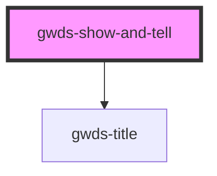

# gw-show-and-tell

<!-- Auto Generated Below -->

## Properties

| Property       | Attribute       | Description | Type                | Default  |
| -------------- | --------------- | ----------- | ------------------- | -------- |
| `alignContent` | `align-content` |             | `"left" \| "right"` | `'left'` |
| `bgColor`      | `bg-color`      |             | `string`            | `null`   |
| `imageAlt`     | `image-alt`     |             | `string`            | `null`   |
| `imageUrl`     | `image-url`     |             | `string`            | `null`   |
| `mainTitle`    | `main-title`    |             | `string`            | `null`   |
| `pb0`          | `pb-0`          |             | `boolean`           | `false`  |
| `preTitle`     | `pre-title`     |             | `string`            | `null`   |
| `pt0`          | `pt-0`          |             | `boolean`           | `false`  |
| `whiteText`    | `white-text`    |             | `boolean`           | `false`  |

## Dependencies

### Depends on

- [gwds-title](../gwds-title)

### Graph

----------------------------------------------

*Built with [StencilJS](https://stenciljs.com/)*
