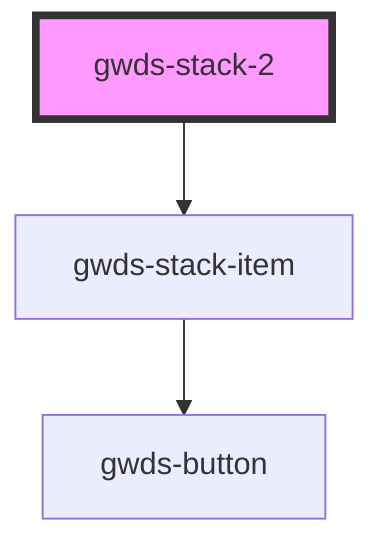

# gwds-stack-2

<!-- Auto Generated Below -->

## Properties

| Property      | Attribute     | Description | Type      | Default      |
| ------------- | ------------- | ----------- | --------- | ------------ |
| `bgColor`     | `bg-color`    |             | `string`  | `'dark-100'` |
| `description` | `description` |             | `string`  | `null`       |
| `mainTitle`   | `main-title`  |             | `string`  | `null`       |
| `pb0`         | `pb-0`        |             | `boolean` | `false`      |
| `pt0`         | `pt-0`        |             | `boolean` | `false`      |

## Dependencies

### Depends on

- [gwds-stack-item](../gwds-stack-item)

### Graph

----------------------------------------------

*Built with [StencilJS](https://stenciljs.com/)*
