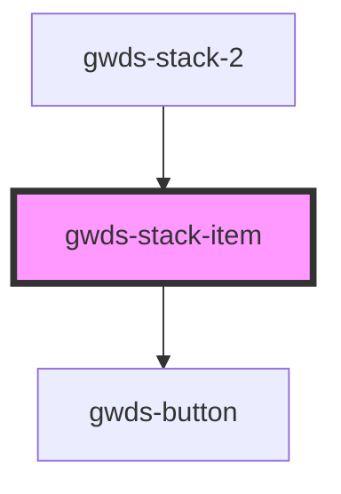

# gwds-stack-item

<!-- Auto Generated Below -->

## Properties

| Property      | Attribute      | Description | Type      | Default |
| ------------- | -------------- | ----------- | --------- | ------- |
| `buttonBlank` | `button-blank` |             | `boolean` | `false` |
| `buttonLabel` | `button-label` |             | `string`  | `null`  |
| `buttonUrl`   | `button-url`   |             | `string`  | `null`  |
| `iconUrl`     | `icon-url`     |             | `string`  | `null`  |
| `mainTitle`   | `main-title`   |             | `string`  | `null`  |
| `visible`     | `visible`      |             | `boolean` | `false` |

## Dependencies

### Used by

 - [gwds-stack-2](../gwds-stack-2)

### Depends on

- [gwds-button](../gwds-button)

### Graph

----------------------------------------------

*Built with [StencilJS](https://stenciljs.com/)*
