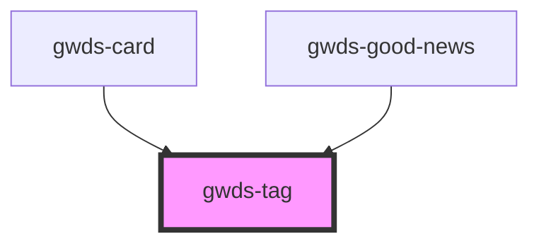

# gwds-tag

<!-- Auto Generated Below -->

## Properties

| Property  | Attribute  | Description | Type     | Default       |
| --------- | ---------- | ----------- | -------- | ------------- |
| `bgColor` | `bg-color` |             | `string` | `'violet-50'` |
| `label`   | `label`    |             | `string` | `null`        |
| `url`     | `url`      |             | `string` | `null`        |

## Dependencies

### Used by

 - [gwds-card](../gwds-card)
 - [gwds-good-news](../gwds-good-news)

### Graph

----------------------------------------------

*Built with [StencilJS](https://stenciljs.com/)*
