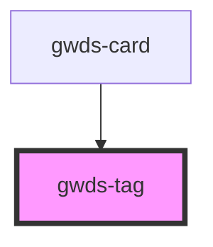

# gwds-tag

<!-- Auto Generated Below -->

## Properties

| Property  | Attribute  | Description | Type          | Default       |
| --------- | ---------- | ----------- | ------------- | ------------- |
| `bgColor` | `bg-color` |             | `"violet-50"` | `'violet-50'` |
| `label`   | `label`    |             | `string`      | `null`        |

## Dependencies

### Used by

 - [gwds-card](../gwds-card)

### Graph

----------------------------------------------

*Built with [StencilJS](https://stenciljs.com/)*
