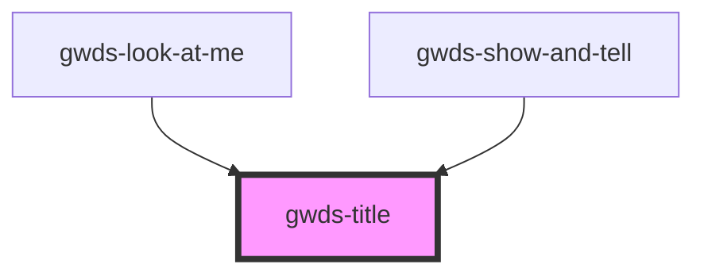

# gw-title

<!-- Auto Generated Below -->

## Properties

| Property | Attribute | Description | Type      | Default                                                  |
| -------- | --------- | ----------- | --------- | -------------------------------------------------------- |
| `light`  | `light`   |             | `boolean` | `false`                                                  |
| `looks`  | `looks`   |             | `string`  | `this.type`                                              |
| `mt0`    | `mt-0`    |             | `boolean` | `false`                                                  |
| `type`   | `type`    |             | `string`  | `'h1' \|\| 'h2' \|\| 'h3' \|\| 'h4' \|\| 'h5' \|\| 'h6'` |

## Dependencies

### Used by

 - [gwds-look-at-me](../gwds-look-at-me)
 - [gwds-show-and-tell](../gwds-show-and-tell)

### Graph

----------------------------------------------

*Built with [StencilJS](https://stenciljs.com/)*
