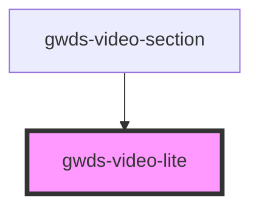

# gwds-video

<!-- Auto Generated Below -->

## Properties

| Property   | Attribute   | Description | Type     | Default  |
| ---------- | ----------- | ----------- | -------- | -------- |
| `maxWidth` | `max-width` |             | `string` | `'100%'` |
| `poster`   | `poster`    |             | `string` | `null`   |
| `videoId`  | `video-id`  |             | `string` | `null`   |

## Dependencies

### Used by

 - [gwds-video-section](../gwds-video-section)

### Graph

----------------------------------------------

*Built with [StencilJS](https://stenciljs.com/)*
