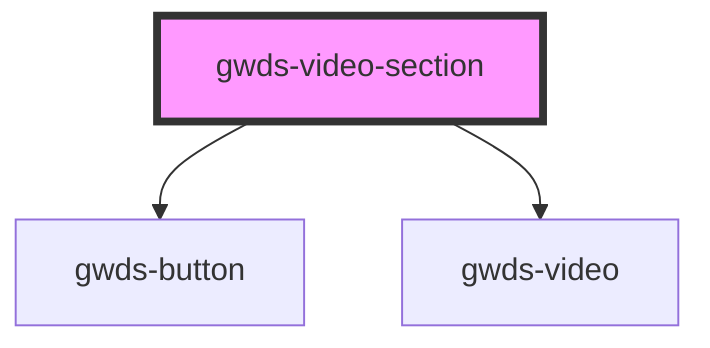

# gwds-video-section

<!-- Auto Generated Below -->

## Properties

| Property             | Attribute              | Description | Type                                     | Default     |
| -------------------- | ---------------------- | ----------- | ---------------------------------------- | ----------- |
| `alignContent`       | `align-content`        |             | `"left" \| "right"`                      | `'left'`    |
| `alignTop`           | `align-top`            |             | `boolean`                                | `false`     |
| `bgColor`            | `bg-color`             |             | `string`                                 | `null`      |
| `firstButtonLabel`   | `first-button-label`   |             | `string`                                 | `null`      |
| `firstButtonTarget`  | `first-button-target`  |             | `"_blank" \| "_self"`                    | `'_self'`   |
| `firstButtonType`    | `first-button-type`    |             | `"primary" \| "secondary" \| "tertiary"` | `'primary'` |
| `firstButtonUrl`     | `first-button-url`     |             | `string`                                 | `null`      |
| `fullWidth`          | `full-width`           |             | `boolean`                                | `true`      |
| `mainTitle`          | `main-title`           |             | `string`                                 | `null`      |
| `pb0`                | `pb-0`                 |             | `boolean`                                | `false`     |
| `pt0`                | `pt-0`                 |             | `boolean`                                | `false`     |
| `secondButtonLabel`  | `second-button-label`  |             | `string`                                 | `null`      |
| `secondButtonTarget` | `second-button-target` |             | `"_blank" \| "_self"`                    | `'_self'`   |
| `secondButtonType`   | `second-button-type`   |             | `"primary" \| "secondary" \| "tertiary"` | `'primary'` |
| `secondButtonUrl`    | `second-button-url`    |             | `string`                                 | `null`      |
| `source`             | `source`               |             | `"vimeo" \| "youtube"`                   | `undefined` |
| `thirdButtonLabel`   | `third-button-label`   |             | `string`                                 | `null`      |
| `thirdButtonTarget`  | `third-button-target`  |             | `"_blank" \| "_self"`                    | `'_self'`   |
| `thirdButtonType`    | `third-button-type`    |             | `"primary" \| "secondary" \| "tertiary"` | `'primary'` |
| `thirdButtonUrl`     | `third-button-url`     |             | `string`                                 | `null`      |
| `url`                | `url`                  |             | `string`                                 | `null`      |

## Dependencies

### Depends on

- [gwds-button](../gwds-button)
- [gwds-video](../gwds-video)

### Graph

----------------------------------------------

*Built with [StencilJS](https://stenciljs.com/)*
