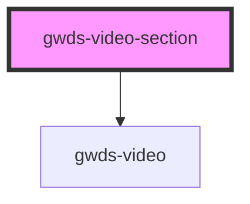

# gwds-video-section

<!-- Auto Generated Below -->

## Properties

| Property       | Attribute       | Description | Type                   | Default     |
| -------------- | --------------- | ----------- | ---------------------- | ----------- |
| `alignContent` | `align-content` |             | `"left" \| "right"`    | `'left'`    |
| `alignTop`     | `align-top`     |             | `boolean`              | `false`     |
| `bgColor`      | `bg-color`      |             | `string`               | `null`      |
| `fullWidth`    | `full-width`    |             | `boolean`              | `true`      |
| `mainTitle`    | `main-title`    |             | `string`               | `null`      |
| `pb0`          | `pb-0`          |             | `boolean`              | `false`     |
| `pt0`          | `pt-0`          |             | `boolean`              | `false`     |
| `source`       | `source`        |             | `"vimeo" \| "youtube"` | `undefined` |
| `url`          | `url`           |             | `string`               | `null`      |

## Dependencies

### Depends on

- [gwds-video](../gwds-video)

### Graph

----------------------------------------------

*Built with [StencilJS](https://stenciljs.com/)*
