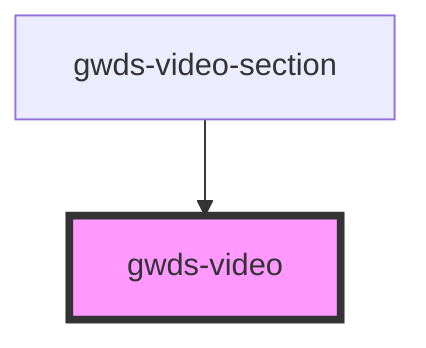

# gwds-video

<!-- Auto Generated Below -->

## Properties

| Property    | Attribute    | Description | Type                   | Default     |
| ----------- | ------------ | ----------- | ---------------------- | ----------- |
| `fullWidth` | `full-width` |             | `boolean`              | `false`     |
| `source`    | `source`     |             | `"vimeo" \| "youtube"` | `'youtube'` |
| `videoId`   | `video-id`   |             | `string`               | `null`      |

## Dependencies

### Used by

 - [gwds-video-section](../gwds-video-section)

### Graph

----------------------------------------------

*Built with [StencilJS](https://stenciljs.com/)*
