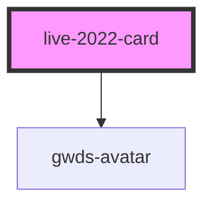

# live-2022-card

<!-- Auto Generated Below -->

## Properties

| Property            | Attribute              | Description | Type     | Default   |
| ------------------- | ---------------------- | ----------- | -------- | --------- |
| `bgColor`           | `bg-color`             |             | `string` | `null`    |
| `cardTitle`         | `card-title`           |             | `string` | `null`    |
| `imageAlt`          | `image-alt`            |             | `string` | `null`    |
| `imageUrl`          | `image-url`            |             | `string` | `null`    |
| `maxWidth`          | `max-width`            |             | `string` | `'500px'` |
| `minWidth`          | `min-width`            |             | `string` | `'250px'` |
| `speaker1AvatarUrl` | `speaker-1-avatar-url` |             | `string` | `null`    |
| `speaker1Name`      | `speaker-1-name`       |             | `string` | `null`    |
| `speaker2AvatarUrl` | `speaker-2-avatar-url` |             | `string` | `null`    |
| `speaker2Name`      | `speaker-2-name`       |             | `string` | `null`    |
| `url`               | `url`                  |             | `string` | `null`    |

## Dependencies

### Depends on

- [gwds-avatar](../gwds-avatar)

### Graph

----------------------------------------------

*Built with [StencilJS](https://stenciljs.com/)*
